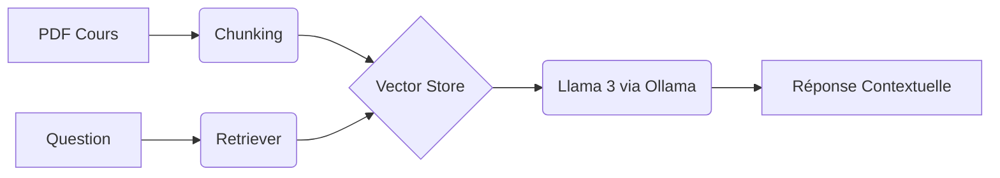

# 📚 Assistant de Révision IA (RAG Local)

> **Solution d'IA souveraine** conçue pour interroger ses cours (PDF, Markdown) en toute confidentialité, sans qu'aucune donnée ne quitte votre machine.


## 🌟 Points Forts
- 🔒 **100% Local :** Utilisation d'Ollama (Llama 3/Mistral). Confidentialité totale garantie.
- 🧠 **Conscience du Contexte :** Utilise la technique du RAG (Retrieval-Augmented Generation) pour limiter les hallucinations.
- ⚡ **Performance :** Optimisé pour tourner sur une configuration matériel standard.

## 🛠️ Architecture


## 🗺️ Roadmap / Avancement
- [x] **Sprint 1 :** Configuration de l'environnement (Ollama, Python venv)
- [ ] **Sprint 2 :** Ingestion des PDF & Text Splitting (Chunking intelligent)
- [ ] **Sprint 3 :** Création du Vector Store (ChromaDB)
- [ ] **Sprint 4 :** Implémentation de la chaîne de Retrieval & Prompt Engineering
- [ ] **Sprint 5 :** Interface utilisateur Streamlit & Visualisation des sources

## 🚀 Installation & Lancement

### 1. Prérequis
- [Ollama](https://ollama.com/) installé et fonctionnel.
- [Python](https://www.python.org/downloads/) 3.10+ installé.

### 2. Configuration
```bash
# 1. Cloner le projet
git clone [https://github.com/xRavess/Projet_RAG-Local.git](https://github.com/xRavess/Projet_RAG-Local.git)
cd Projet_RAG-Local

# 2. Créer l'environnement virtuel
python -m venv .venv

# 3. Activer l'environnement
# Sur Windows :
.venv\Scripts\activate
# Sur Mac/Linux :
source .venv/bin/activate

# 4. Installer les dépendances
pip install -r requirements.txt
### 3. Lancement
```bash
streamlit run app.py
```

---
*Projet réalisé dans le cadre d'un cycle ingénieur à CY Tech.*
